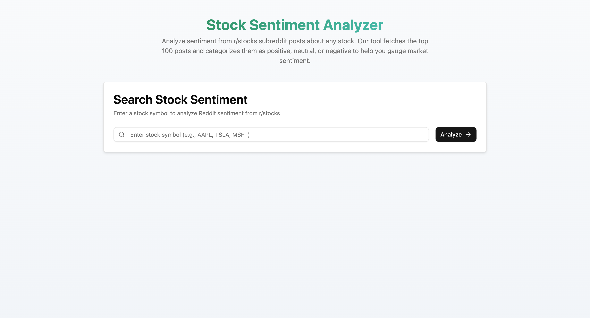
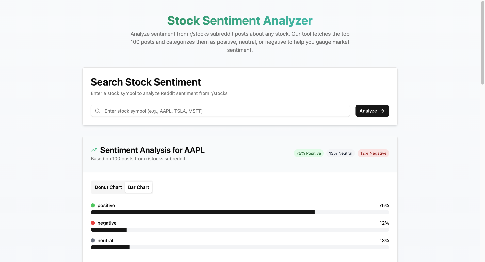
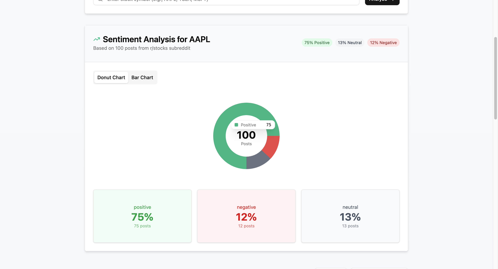
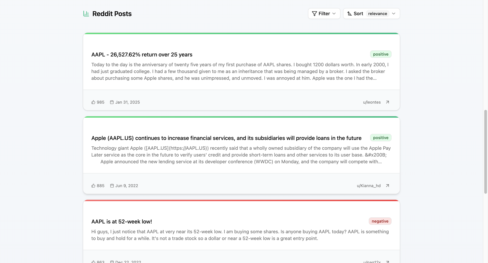

# Reddit Stock Sentiment Analyzer 🧠📈

This is a full-stack web application that performs sentiment analysis on up to 100 recent Reddit posts about a stock symbol using machine learning models with **FinBERT embeddings** and additional text features. It is built with a **FastAPI** backend and a **React (Vite)** frontend.

## ✨ Features

- 🔍 Fetches and displays up to 100 latest matching posts from multiple finance subreddits.
- 🧠 Classifies each post as **Positive**, **Neutral**, or **Negative** using trained ML models.
- 📈 Uses FinBERT (pre-trained on financial text) for generating embeddings.
- 📊 Incorporates additional text features like word count and VADER sentiment scores.
- 🛡️ Includes backend API error handling and frontend request timeout/error messaging.
- ⚡ Built with FastAPI for robust backend performance.
- ⚛️ Clean and fast React interface via Vite.

## 📸 Screenshots









## 🚀 Getting Started

#### 1. Clone the Repository

```bash
git clone https://github.com/anismabaziz/stock-mood
cd stock-mood
```

#### 2. Backend Setup

```bash
# Navigate to backend directory
cd backend

# Install uv (if you don't have it yet)
# macOS/Linux: curl -LsSf https://astral.sh/uv/install.sh | sh

# Sync dependencies (creates .venv automatically)
uv sync
```

Python note: backend dependencies are pinned for Python 3.11/3.12 compatibility.

#### 3. Environment Configuration

Create a `.env` file in the backend directory:

```bash
reddit_client_id='your reddit client_id'
reddit_client_secret='your reddit client_secret'
reddit_user_agent='your reddit user_agent'
frontend_url='frontend dev url'
frontend_build='frontend production url'
```

Create a `.env` file in the frontend directory:

```bash
VITE_API_URL='backend dev url'
```

#### 4. Frontend Setup

```bash
# Navigate to frontend directory
cd ../frontend

# Install dependencies
npm install
```

### 🏃‍♂️ Running the Application

#### Start Backend Server

```bash
cd backend
uv run uvicorn main:app --reload
```

Backend URLs:

- Health check: `http://127.0.0.1:8000/ping`
- OpenAPI docs: `http://127.0.0.1:8000/docs`

#### Start Frontend Development Server

```bash
cd frontend
npm run dev
```

If the frontend cannot reach the backend, verify `frontend/.env`:

```bash
VITE_API_URL=http://127.0.0.1:8000
```

Then restart the frontend dev server.

## 🧠 Machine Learning Model

### Model Selection & Testing

I tested multiple models to find the best performer:

- **Logistic Regression**: Baseline linear classifier
- **Random Forest**: Ensemble method with decision trees
- **Gradient Boosting**: Sequential ensemble learning
- **SVM**: Support Vector Machine with probability estimation
- **XGBoost**: Gradient boosting framework
- **MLP (scikit-learn)**: Multi-Layer Perceptron classifier
- **Custom Neural Network**: Self-implemented deep learning model - **Selected Model**

### Feature Engineering

- **FinBERT Embeddings**: Contextualized embeddings from financial domain pre-trained BERT
- **Text Statistics**: Word count and other linguistic features
- **VADER Sentiment**: Rule-based sentiment analysis scores as additional features
- **Training Data**: Labeled financial news articles (not Reddit-specific)
- **Model Accuracy**: ~80% on the validation set

The final model uses a **custom-built neural network** that combines FinBERT's powerful contextual understanding with traditional text features and VADER sentiment scores to achieve robust sentiment classification on financial discussions.

## 🛠️ Tech Stack

### Frontend:

- React (Vite)
- Axios

### Backend:

- FastAPI
- PRAW
- FinBERT (via HuggingFace Transformers)
- VADER Sentiment (via NLTK)
- scikit-learn / TensorFlow (for ML models)
- XGBoost
